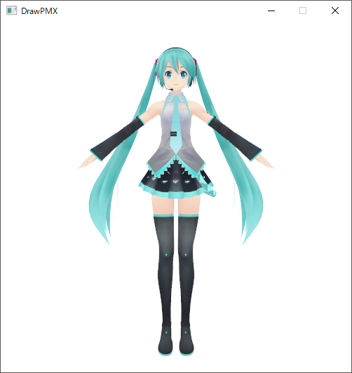

# Draw PMX

  

PMXファイルをただ描画するだけのプログラムです。
また、以下は対応しておりません。

- UTF-16（PMXのデフォルト設定）の文字コードを使用しているPMXファイル
- PMX2.0 以外のVersionのPMXファイル

## コンパイル時の注意

コンパイル前にDirectX11のSDKにパスを通す必要があります。  
こちらのサイトにDirectX11のSDKのインストール方法が載っているので、参考までに。  
[Visual Studio 2015でDirectXの開発環境を作る](http://www.charatsoft.com/develop/otogema/page/00environment/index.htm)  
また、プロジェクトにSDKのincludeフォルダのパスとlibフォルダのパスを通す必要があります。

## LICENSE

[MIT](LICENSE)